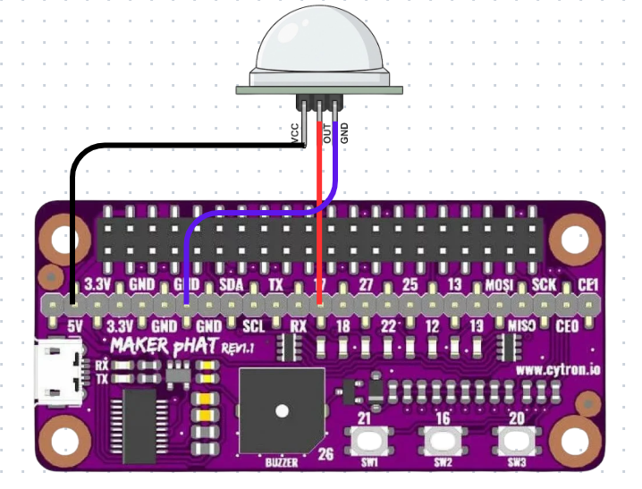

# Week-4_pir-motion-makerphat
# PIR Motion Detection with Maker pHAT

This project uses:

- Raspberry Pi Zero WH
- Cytron Maker pHAT
- PIR Sensor
- Python GPIO

## GPIO Mapping (BCM)

- PIR → GPIO17
- LED → GPIO22
- Buzzer → GPIO27

## Run

sudo python3 motion_detection.py

## Wiring Diagram

